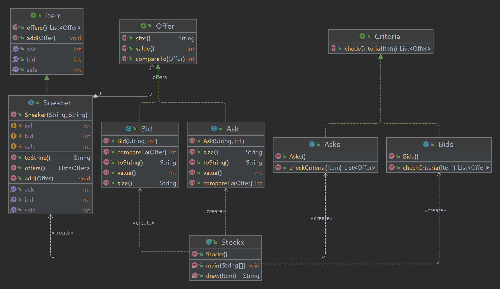

# StockX ASCII

## V. Examen Programación DAW Dual
StockX, una empresa de subastas de zapatos online, quiere crear una aplicación de terminal para poder interactuar con sus servicios.  
Crea el programa con la ayuda del diagrama UML.  

StockX, a company of shoe auctions online, wants to create a CLI application to interact with its services.  
Create the program with the help of the UML diagram.  

## Key-Concepts :dart: 
- Filter/Criteria Pattern
- User Stories
- Jordan

## UML
